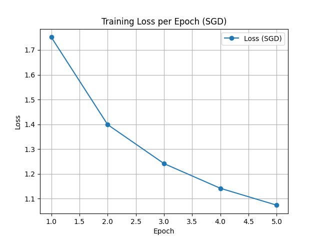
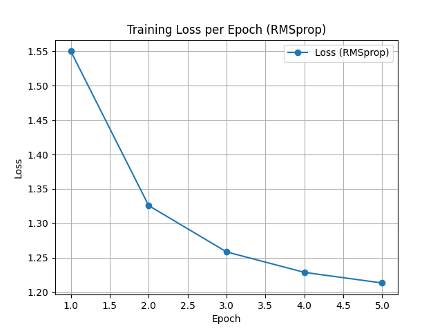

# Optimize computer vision models

Практика по курсу "Оптимизация моделей компьютерного зрения"  

# Задание №2

Главным заданием было сравнить сходимость двух алгоритмов 

SGD и RMSprop

По графику видно, что RMSproup справился лучше, так как ошибка (loss)
у него меньше. 

RMSProp может быть предпочтительнее в следующих случаях:
при обучении модели с множеством параметров, если возникают проблемы 
с расходимостью или колебаниями во время обучения; 
если сложно настроить скорость обучения, 
так как RMSProp масштабирует градиенты, 
что помогает процессу оптимизации более плавно сходиться независимо 
от скорости обучения.
при обучении модели по зашумлённой или нерегулярной функции потерь,
так как RMSProp сглаживает краткосрочные колебания и выделяет долгосрочные
тренды, что помогает снизить влияние шума и быстрее сходиться модели.

SGD может быть полезен, если данные огромны,
а время вычислений является важным фактором, 
так как он лучше обобщает данные за счёт низкой скорости вычислений

# Задание №3
Оптимизация гиперпараметров с помощью optune.

Датасет FashionMnist был заменен на датасет CIFAR-10

Вывод консоли:
Study statistics: 
Number of finished trials: 47 
Number of pruned trials: 29 
Number of complete trials: 18 
Best trial: 
Value: 0.5453125 
Params: dropout: 0 optimizer: Adam lr: 0.003354162221602514